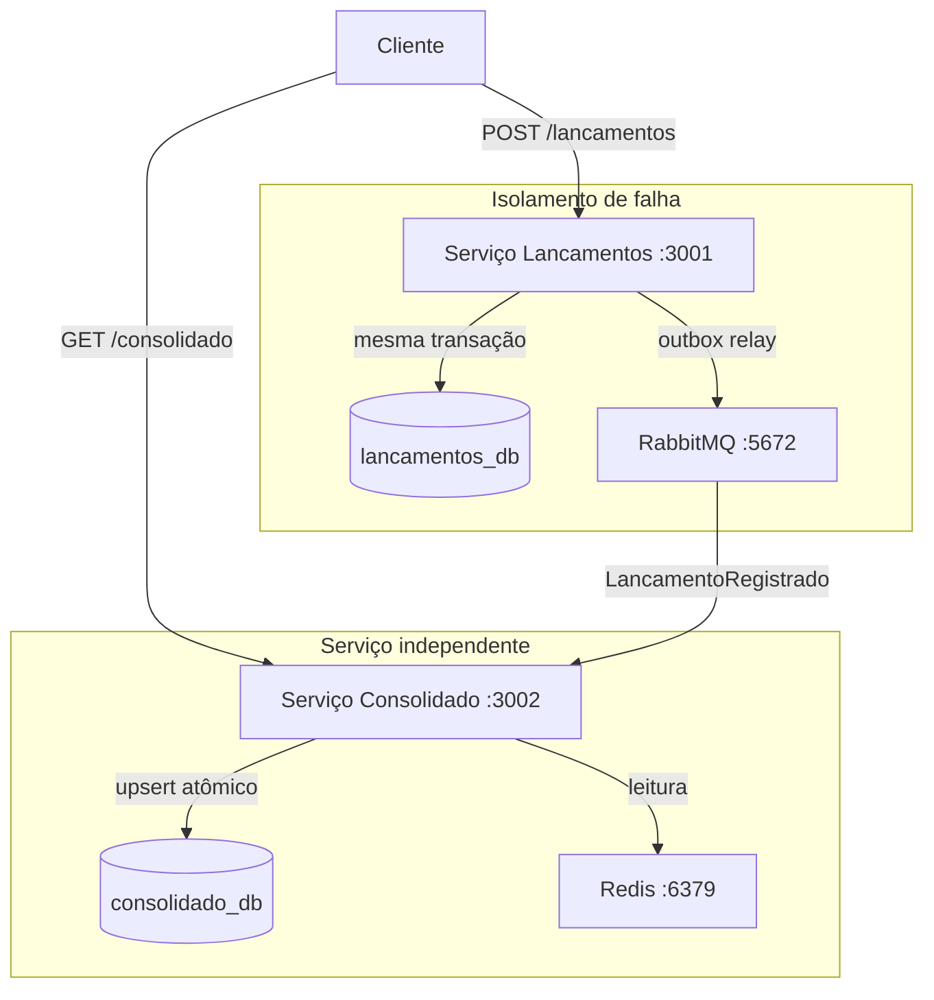

# Controle de Fluxo de Caixa

Dois microsserviços independentes: Lancamentos registra débitos e créditos;
Consolidado mantém a projeção de saldo diário por data. Eles nunca se comunicam
diretamente. Lancamentos grava o evento na mesma transação do lançamento (Outbox Pattern)
e um relay o publica no RabbitMQ; Consolidado consome e aplica um upsert atômico no
próprio banco.

A consequência prática: Consolidado pode cair sem interromper o registro de lançamentos.
O evento fica enfileirado e é processado quando o serviço voltar. Idempotência garante que
reentregas não duplicam o saldo.



| Decisão | Escolha | Motivo |
|---|---|---|
| Comunicação | RabbitMQ assíncrono | Lançamentos nunca depende do Consolidado estar no ar |
| Persistência de eventos | Outbox Pattern | Evento gravado na mesma transação do lançamento, zero perda se o broker oscilar |
| Idempotência | `eventos_processados` PK | Redelivery não duplica saldo |
| Concorrência no saldo | Upsert atômico (`ON CONFLICT DO UPDATE`) | Sem race condition com múltiplos consumidores |
| Valores monetários | `NUMERIC(15,2)` + `decimal.js` | Float binário não representa dinheiro com precisão |
| Cache | Redis com fallback no banco | GET /consolidado suporta 50 req/s com <5% de perda |

---

## Pré-requisitos

- Docker Desktop >= 4.x
- Portas livres: 3001, 3002, 5432, 5672, 6379, 15672

---

## Subindo o sistema

```bash
cp .env.example .env
docker compose up -d
```

Aguarde ~30s. `docker compose ps` deve mostrar os 5 containers (`postgres`, `rabbitmq`,
`redis`, `lancamentos`, `consolidado`) com status `healthy`.

Portas: lancamentos `:3001`, consolidado `:3002`, RabbitMQ Management `:15672`.

---

## Autenticação

O endpoint `/auth/login` devolve um token JWT sem verificar credenciais e existe para
facilitar o teste local. Em produção isso seria substituído por OAuth2.

**bash / zsh:**

```bash
TOKEN=$(curl -s -X POST http://localhost:3001/auth/login \
  -H 'Content-Type: application/json' \
  -d '{}' | grep -o '"token":"[^"]*"' | cut -d'"' -f4)
```

**PowerShell:**

```powershell
$TOKEN = (curl.exe -s -XPOST http://localhost:3001/auth/login `
  -H 'Content-Type: application/json' `
  -d '{}' | ConvertFrom-Json).token
```

Token válido por 24h. JWT_SECRET padrão: `dev-secret-change-in-production`.

---

## Usando a API

Os exemplos abaixo usam `$TOKEN` (bash/zsh). No PowerShell use `$TOKEN` e substitua
`curl` por `curl.exe` em todos os comandos para evitar o alias do PowerShell.

### Lançamentos

```bash
# Registrar crédito
curl -s -X POST http://localhost:3001/lancamentos \
  -H "Content-Type: application/json" \
  -H "Authorization: Bearer $TOKEN" \
  -d '{"valor": 1500.00, "tipo": "credito", "descricao": "Venda produto X", "data": "2026-06-15"}' | jq

# Registrar débito
curl -s -X POST http://localhost:3001/lancamentos \
  -H "Content-Type: application/json" \
  -H "Authorization: Bearer $TOKEN" \
  -d '{"valor": 350.50, "tipo": "debito", "descricao": "Compra insumos", "data": "2026-06-15"}' | jq

# Com chave de idempotência, reenvia o mesmo X-Idempotency-Key não cria duplicata
curl -s -X POST http://localhost:3001/lancamentos \
  -H "Content-Type: application/json" \
  -H "Authorization: Bearer $TOKEN" \
  -H "X-Idempotency-Key: pedido-7742" \
  -d '{"valor": 200.00, "tipo": "credito", "descricao": "Ajuste", "data": "2026-06-15"}' | jq

# Listar lançamentos do dia
curl -s "http://localhost:3001/lancamentos?data=2026-06-15" \
  -H "Authorization: Bearer $TOKEN" | jq
```

### Consolidado

O saldo reflete lançamentos com até ~5s de atraso (consistência eventual via RabbitMQ).
O campo `source` na resposta indica `"cache"` (Redis) ou `"database"` (Postgres, preencheu o cache).

```bash
curl -s "http://localhost:3002/consolidado/2026-06-15" \
  -H "Authorization: Bearer $TOKEN" | jq
```

---

## Testes

### Unitários

Rodam dentro do container, sem infra externa.

```bash
docker compose run --rm lancamentos npm test   # 9 testes
docker compose run --rm consolidado npm test   # 14 testes
```

### Integração — DLQ e retry com broker real

```bash
bash test-integration.sh
```

Sobe infra isolada (postgres:5433, rabbitmq:5673, redis:6380), roda o teste e destrói tudo.
Tempo esperado: ~15s.

O que é testado: retry com backoff exponencial, dead-letter após 3 tentativas, e
processamento válido sem interação com DLQ, tudo contra um broker RabbitMQ real, não mock.

---

## Teste de carga (k6)

Prova o requisito de 50 req/s em `GET /consolidado/{data}` com < 5% de perda.
Dois cenários em sequência: cache quente (Redis) e pior caso (Postgres, 60 datas distintas).
Exit code 0 = todos os thresholds passaram.

```bash
docker compose --profile loadtest run --rm k6
```

Detalhes, thresholds e saída esperada em `tests/load/README.md`.

---

## Isolamento de falha — verificação manual

```bash
# Derruba o Consolidado
docker compose stop consolidado

# Lançamentos continua respondendo 201, o isolamento funciona
curl -s -X POST http://localhost:3001/lancamentos \
  -H "Content-Type: application/json" \
  -H "Authorization: Bearer $TOKEN" \
  -d '{"valor": 999.00, "tipo": "credito", "descricao": "Teste de isolamento", "data": "2026-06-20"}' | jq

# Sobe o Consolidado, drena a fila automaticamente
docker compose start consolidado
sleep 5

# Saldo aparece, consistência eventual
curl -s "http://localhost:3002/consolidado/2026-06-20" \
  -H "Authorization: Bearer $TOKEN" | jq
```

O lançamento foi gravado no banco e no outbox na mesma transação. O relay publicou no broker.
Quando o Consolidado voltou, consumiu o evento e aplicou o upsert. Nenhum evento perdido,
nenhum duplicado.

---

## Observabilidade (profile opcional)

```bash
docker compose --profile observability up -d
# Grafana:    http://localhost:3000  (admin/admin)
# Prometheus: http://localhost:9090
# RabbitMQ:   http://localhost:15672 (rabbit/rabbit)
```

---

## Documentação

- `docs/arquitetura.md` — C4 Context/Container/Component com diagramas Mermaid
- `docs/adrs/` — 7 ADRs cobrindo as decisões de projeto
- `docs/requisitos.md` — requisitos funcionais e não-funcionais
- `docs/seguranca.md` — autenticação, rate limiting, modelo de segurança para produção
- `docs/arquitetura-alvo-cloud.md` — deploy na AWS (ECS, RDS, MQ, ElastiCache)
- `docs/custos.md` — estimativa de custo mensal
- `tests/load/README.md` — detalhes do teste de carga k6

---

## Diferenças em relação a um ambiente de produção

Simplificações conscientes, não esquecimentos.

| Aspecto | Neste desafio | Em produção |
|---|---|---|
| Instâncias de banco | `lancamentos_db` e `consolidado_db` no mesmo Postgres | Instâncias separadas (RDS separados), um banco sobrecarregado não degrada o outro |
| RabbitMQ | Single-node | Cluster de 3 nós com quorum queues, sem clustering, morte do broker antes do ack é perda permanente |
| Publisher confirms | `channel.publish()` marca publicado quando o buffer TCP aceita | `channel.waitForConfirms()` antes de marcar, sem confirms, o broker pode morrer antes de persistir |
| Redis | Standalone | Redis Sentinel ou ElastiCache Multi-AZ, failover automático elimina o pico de miss após reinício |
| Outbox relay | `setInterval` de 1s consultando `status='pendente'` | CDC via Debezium lendo o WAL — reage em ~50ms, sem SELECT periódico ao banco |
| Migrações | Rodam no startup do serviço | Passo separado no pipeline de CI/CD antes de qualquer instância nova subir e evita colisão entre pods |
| Autenticação | JWT com secret em `.env`, endpoint `/auth/login` sem credenciais | OAuth2/OIDC (Cognito, Keycloak) com tokens de curta duração — o endpoint sem credenciais é uma vulnerabilidade em produção |
| TLS | HTTP puro | TLS em endpoints públicos; mTLS ou service mesh na comunicação interna |
| Logs | `pino` para stdout | Coleta com Fluentd/Firehose para CloudWatch Logs com retenção e alertas |
