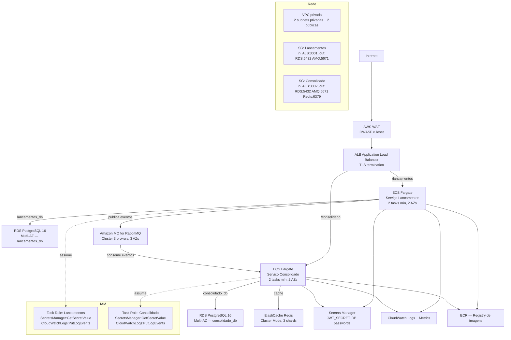

# Arquitetura Alvo — AWS

Mapeamento 1:1 do ambiente local para serviços gerenciados AWS, com as adaptações necessárias para alta disponibilidade de produção.

## Diagrama



---

## Mapeamento Local → AWS

| Local | AWS | Notas |
|---|---|---|
| `lancamentos` (Docker) | ECS Fargate Task | Sem gerenciamento de instância; escala por task count |
| `consolidado` (Docker) | ECS Fargate Task | Escala independente do Lançamentos |
| PostgreSQL único (2 DBs) | **Dois RDS PostgreSQL 16 separados** (Multi-AZ) | Local: 2 databases na mesma instância para simplificar. Produção: instâncias separadas — um banco sobrecarregado não degrada o outro |
| RabbitMQ (Docker single-node) | Amazon MQ for RabbitMQ (cluster 3 brokers) | Quorum queues replicadas em 3 AZs; DLQ durável nativa |
| Redis (Docker single-node) | ElastiCache Redis Cluster Mode | 3 shards × 1 réplica; failover automático <30s |
| Nginx/proxy | ALB | Roteamento de path, TLS termination, health checks |
| — | API Gateway (opcional) | Rate limiting centralizado, autenticação por chave de API para integrações B2B |
| Logs (stdout) | CloudWatch Logs | Coletados automaticamente pelo ECS; retenção configurável; alertas em cima de error rate |
| — | X-Ray | Tracing distribuído — **evolução futura** (não implementado neste baseline). Ver [observabilidade.md](observabilidade.md) |
| `.env` | Secrets Manager | Rotação automática; referenciado nas task definitions via `secrets:` |
| Dockerfile | ECR | Registry privado; imagens escaneadas por vulnerabilidade automaticamente |

> **Nota sobre RDS:** No ambiente local, `lancamentos_db` e `consolidado_db` residem na mesma instância PostgreSQL (dentro do mesmo container). Em produção, devem ser instâncias RDS **separadas**: isolamento de falha real (um VACUUM agressivo ou conexão pool exaurido em uma não afeta a outra), políticas de backup independentes e capacidade dimensionada por perfil de carga — Lançamentos é write-heavy, Consolidado é read-heavy.

---

## IAM — Princípio do Menor Privilégio

Cada ECS Task assume uma IAM Role separada. As permissões são restritas ao mínimo necessário:

```json
{
  "Effect": "Allow",
  "Action": [
    "secretsmanager:GetSecretValue"
  ],
  "Resource": [
    "arn:aws:secretsmanager:us-east-1:ACCOUNT:secret:desafio-as/lancamentos/*"
  ]
}
```

Nenhum serviço tem acesso de escrita a secrets ou a recursos do outro serviço. A comunicação interna (serviço → RDS, serviço → Amazon MQ) usa Security Groups com ingress restrito à porta e origem exata.

---

## Escalabilidade e Alta Disponibilidade

**Lançamentos (write-heavy):**
- ECS Auto Scaling por CPU (target 60%): mín 2 tasks em 2 AZs, máx configurável
- O Outbox Relay roda por processo — N tasks = N relays em paralelo, aumentando throughput de publicação linearmente
- RDS Multi-AZ com failover automático < 60s (com read replica para queries de relatório)

**Consolidado (read-heavy):**
- ECS Auto Scaling por request count: mín 2 tasks
- ElastiCache Redis Cluster Mode com read replicas absorve picos de leitura de saldo
- RDS com Read Replica para queries analíticas; o consumer usa a primária (escrita)
- `prefetch=1` por consumer: N tasks = N mensagens em processamento paralelo, sem coordenação

**RabbitMQ:**
- Amazon MQ com 3 brokers em 3 AZs (Quorum Queues — substitui mirroring clássico deprecado no 3.12+)
- Mensagens persistem enquanto a maioria dos nós (2/3) estiver operacional
- DLQ configurada por fila: `consolidado.lancamentos.dlq` durável

---

## Equivalente GCP

Cloud Run (lancamentos + consolidado) → Cloud SQL PostgreSQL (2 instâncias) → Google Cloud Pub/Sub → Memorystore (Redis) → Cloud Armor (WAF) → Cloud Logging → Cloud Trace (tracing futuro).

---

## Estimativa de Custos

Ver [custos.md](custos.md).
