# Arquitetura de Transição — Strangler Fig Pattern

## Contexto

O sistema atual pode coexistir com um monolito legado (ex: ERP em Java/PHP que já controla fluxo de caixa). Esta documentação descreve como migrar incrementalmente, sem downtime e sem perda de dados, do legado para a arquitetura de microsserviços.

O Strangler Fig cria o novo sistema em paralelo e transfere o tráfego gradualmente — até que o legado possa ser desligado com segurança.

---

## Fases de Migração

```mermaid
graph TD
    subgraph "Fase 1 — Proxy na frente do legado"
        CLI1[Clientes] -->|100% tráfego| PROXY1[API Gateway / Nginx]
        PROXY1 -->|tudo| LEG1[Monolito Legado]
    end

    subgraph "Fase 2 — Novo Lançamentos em paralelo"
        CLI2[Clientes] --> PROXY2[API Gateway]
        PROXY2 -->|POST /lancamentos 50%| NOVO_L[Novo Serviço\nLancamentos]
        PROXY2 -->|POST /lancamentos 50%| LEG2[Monolito Legado]
        NOVO_L -->|eventos| MQ[RabbitMQ]
    end

    subgraph "Fase 3 — Consolidado novo, legado em read-only"
        LEG3[Monolito Legado] -->|CDC / batch sync| MQ2[RabbitMQ]
        MQ2 --> NOVO_C[Novo Serviço\nConsolidado]
        PROXY3[API Gateway] -->|GET /consolidado 100%| NOVO_C
        PROXY3 -->|POST /lancamentos 100%| NOVO_L2[Novo Serviço\nLancamentos]
    end

    subgraph "Fase 4 — Legado desligado"
        PROXY4[API Gateway] -->|100%| SVC_L[Lancamentos]
        SVC_L -->|eventos| MQ3[RabbitMQ]
        MQ3 --> SVC_C[Consolidado]
    end
```

---

## Plano Detalhado

### Fase 1 — Proxy (Semana 1-2)

**Objetivo:** Ponto de controle de roteamento sem alterar comportamento.

1. Instalar API Gateway (AWS ALB, Kong ou Nginx) na frente do monolito
2. Todos os requests continuam indo para o legado — zero mudança funcional
3. Validar que latência e taxa de erro se mantêm iguais ao baseline pré-proxy

**Critério de saída:** Proxy em produção com < 5ms de latência adicional, monitorado por 48h sem incidentes.

### Fase 2 — Novo Lançamentos em shadow/canary (Semana 3-4)

**Objetivo:** Validar que o novo serviço produz os mesmos resultados que o legado.

1. Deploy do novo `lancamentos` em paralelo (sem tráfego de produção)
2. Shadow mode: o proxy envia uma cópia de cada request para o novo serviço; comparar respostas sem expor ao cliente
3. Quando shadow validado: canary a 10% → 50% → 100%, controlado por feature flag no API Gateway
4. O novo serviço publica `LancamentoRegistrado` no RabbitMQ desde o primeiro request

**Ponto crítico:** Durante a fase canary (Lançamentos dividido entre legado e novo), o Consolidado não existe ainda. Os eventos publicados pelo novo serviço ficam acumulados na fila — isso é esperado. A fila deve ser monitorada para não crescer além da capacidade do broker.

**Critério de saída:** 100% dos POSTs no novo serviço, zero erro introduzido, legacy apenas recebendo GETs.

### Fase 3 — Consolidado novo e sync histórico (Semana 5-6)

**Objetivo:** Migrar a visão de saldo para o novo serviço sem divergência de dados.

1. **Sync histórico:** Ler todos os lançamentos do banco do legado e injetá-los como eventos `LancamentoRegistrado` no RabbitMQ. O novo Consolidado os consome e reconstrói o saldo histórico inteiro.
   - A idempotência do consumer (`eventos_processados`) previne duplicatas se o sync rodar mais de uma vez
   - O `lancamentoId` do evento deve ser o ID original do legado para manter rastreabilidade
2. Deploy do novo `consolidado`
3. Comparar saldos diários: novo Consolidado vs legado, data a data, por no mínimo 24h
4. Roteamento de GETs: 10% → 50% → 100% com rollback imediato via feature flag se divergência detectada

**Critério de saída:** Saldos do novo Consolidado batem com o legado para todos os dias históricos. Taxa de divergência = 0%.

### Fase 4 — Descomissionamento (Semana 7-8)

1. 100% do tráfego nos novos serviços (já desde o final da Fase 3)
2. Legado em modo **read-only** por 2 semanas: aceita GETs para rollback de emergência, rejeita POSTs
3. Desligar o legado após 2 semanas sem incidentes
4. Remover regras de roteamento do legado no API Gateway

---

## Critérios de Rollback

| Trigger | Ação |
|---|---|
| Taxa de erro nos novos endpoints > 1% | Rollback imediato para 100% legado via feature flag no API Gateway |
| Divergência de saldo entre legado e novo Consolidado | Pausar migração; investigar eventos perdidos ou duplicados; nunca continuar com divergência conhecida |
| Latência p95 > 2× baseline | Investigar antes de continuar o canary |

---

## Riscos e Mitigações

| Risco | Probabilidade | Mitigação |
|---|---|---|
| Dados históricos não sincronizados | Média | Sync com validação linha a linha; comparar hash dos saldos por data antes de migrar GETs |
| Duplicidade de eventos durante a fase 2 (canary + legado publicando) | Alta se legado também publicar | Legado NÃO deve publicar eventos — apenas o novo serviço. Se o legado já publicar no broker por outro motivo, o consumer precisa filtrar por `correlationId` ou fonte |
| Performance degradada durante o sync histórico | Média | Executar sync em horário de baixo tráfego com rate limiting (ex: 100 eventos/s) |
| Rollback após Fase 4 | Baixa | Manter backup do banco do legado por 30 dias após descomissionamento |
| Idempotência do sync vs. idempotência de produção | Baixa | Usar o mesmo `evento_id` derivado do ID do lançamento legado — garante que replay e sync usam o mesmo espaço de IDs |
