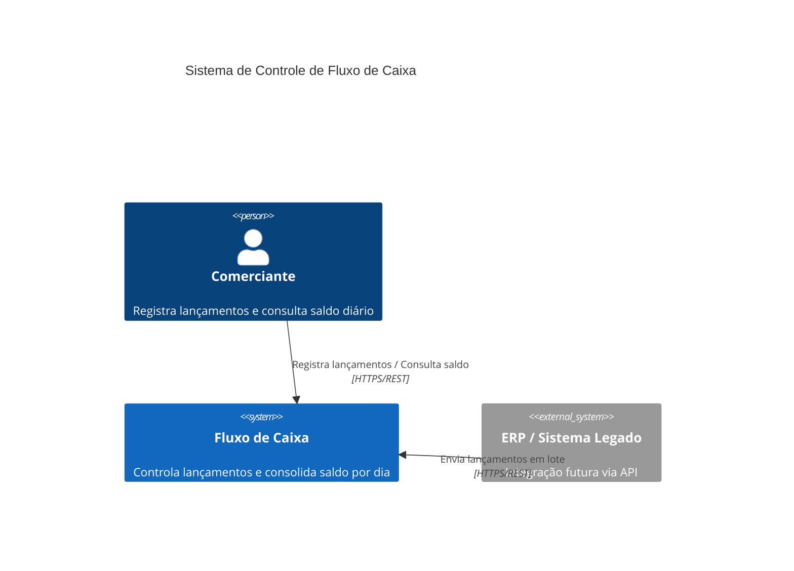
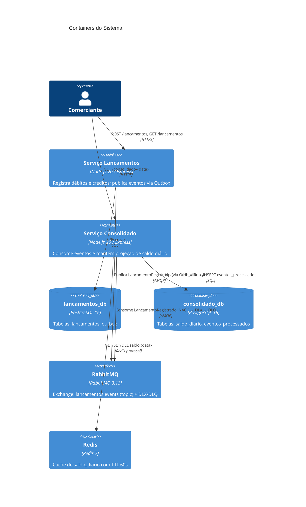
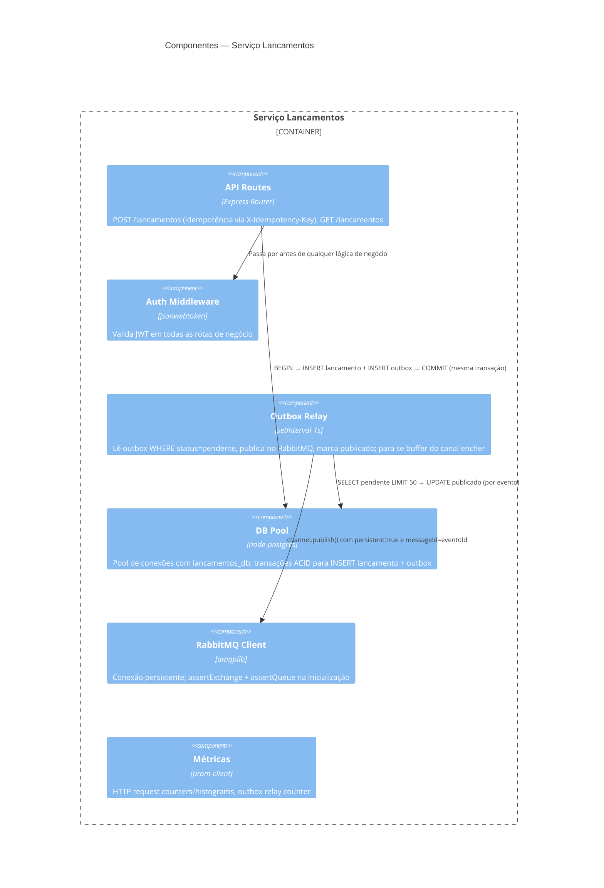
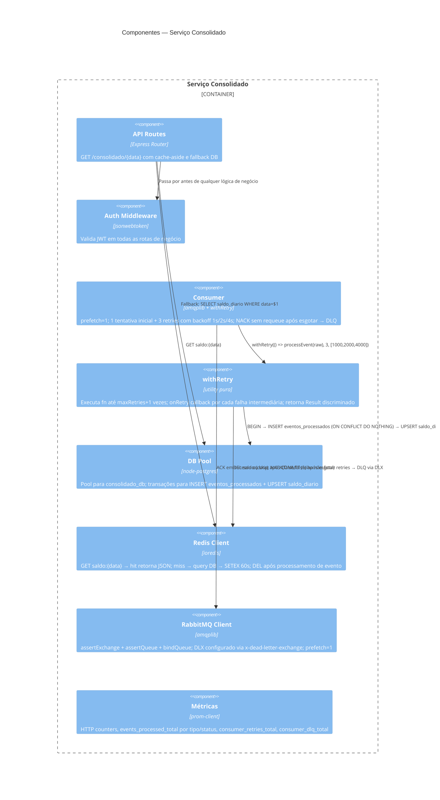
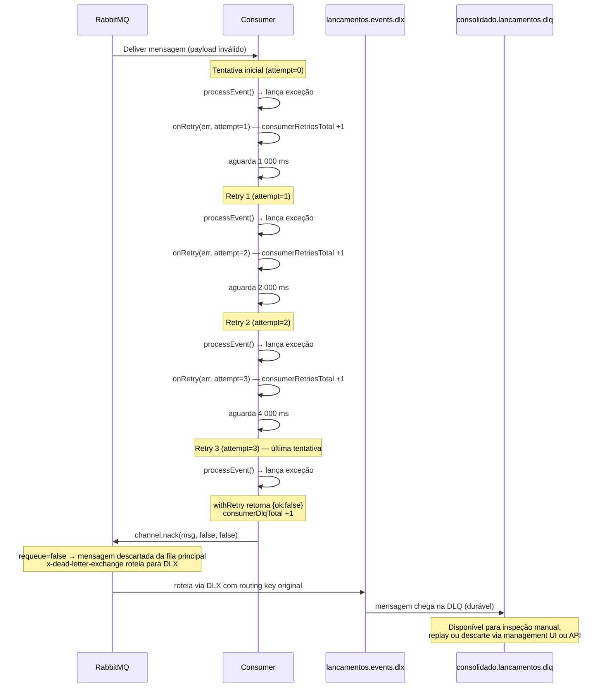

# Arquitetura do Sistema

## C4 — Nível 1: Contexto



---

## C4 — Nível 2: Containers



---

## C4 — Nível 3: Componentes do Serviço Lancamentos



---

## C4 — Nível 3: Componentes do Serviço Consolidado



---

## Diagrama de Sequência — Fluxo Feliz

```mermaid
sequenceDiagram
    participant C as Cliente
    participant L as Lancamentos
    participant DB_L as lancamentos_db
    participant RMQ as RabbitMQ
    participant CONS as Consolidado Consumer
    participant DB_C as consolidado_db
    participant REDIS as Redis

    C->>L: POST /lancamentos {valor, tipo, data}
    L->>DB_L: BEGIN TRANSACTION
    L->>DB_L: INSERT lancamentos
    L->>DB_L: INSERT outbox (status=pendente, payload=LancamentoRegistrado)
    L->>DB_L: COMMIT
    L-->>C: 201 Created {id, valor, tipo, data}

    Note over L: Relay executa a cada 1s

    L->>DB_L: SELECT outbox WHERE status=pendente ORDER BY created_at LIMIT 50
    L->>RMQ: channel.publish(exchange, routingKey, payload, {persistent:true, messageId:eventoId})
    L->>DB_L: UPDATE outbox SET status=publicado WHERE id=$1

    RMQ->>CONS: Deliver LancamentoRegistrado (prefetch=1)
    CONS->>DB_C: BEGIN TRANSACTION
    CONS->>DB_C: INSERT eventos_processados (eventoId) ON CONFLICT DO NOTHING
    Note over DB_C: rowCount=1 → evento novo; rowCount=0 → já processado, skip + ACK
    CONS->>DB_C: UPSERT saldo_diario SET saldo = saldo_diario.saldo + delta
    CONS->>DB_C: COMMIT
    CONS->>REDIS: DEL saldo:{data} (invalida cache)
    CONS->>RMQ: channel.ack(msg)

    C->>CONS: GET /consolidado/2026-06-24
    CONS->>REDIS: GET saldo:2026-06-24
    alt cache hit
        REDIS-->>CONS: JSON {total_creditos, total_debitos, saldo}
    else cache miss
        CONS->>DB_C: SELECT * FROM saldo_diario WHERE data=$1
        DB_C-->>CONS: row
        CONS->>REDIS: SETEX saldo:2026-06-24 60
    end
    CONS-->>C: 200 {total_creditos, total_debitos, saldo, source}
```

---

## Diagrama de Sequência — Fluxo de Falha (Retry + DLQ)

Este diagrama mostra o caminho de uma mensagem que falha em processamento de forma persistente — por exemplo, um payload com valor não-numérico que sempre lança no `new Decimal(valor)`.



**Resumo do comportamento:**
- 4 chamadas a `processEvent` no total (1 inicial + 3 retries)
- 3 incrementos em `consumerRetriesTotal` (um por callback de retry)
- 1 incremento em `consumerDlqTotal`
- Tempo mínimo antes do NACK: 1 000 + 2 000 + 4 000 = **7 segundos** (mais tempo de execução das 4 tentativas)

---

## Contrato do Evento `LancamentoRegistrado`

### Campos

| Campo | Tipo | Emitido pelo relay | Descrição |
|---|---|---|---|
| `eventoId` | `string (UUID v4)` | `uuid()` | ID único do evento — PK em `eventos_processados` para idempotência |
| `schemaVersion` | `string` | `"1.0"` | Versão do schema; consumidor valida apenas se `tipo` é conhecido |
| `tipo` | `string` | `"LancamentoRegistrado"` | Tipo do evento; mensagens com tipo desconhecido são ACKadas sem processar |
| `correlationId` | `string (UUID v4)` | do header `X-Correlation-Id` ou gerado | ID de rastreamento; propagado nos logs do consumer para correlação manual |
| `createdAt` | `string (ISO 8601)` | `new Date().toISOString()` | Timestamp de criação do evento |
| `data.lancamentoId` | `string (UUID v4)` | ID do registro em `lancamentos` | FK lógica ao lançamento de origem (sem JOIN) |
| `data.valor` | `string` | valor como `NUMERIC(15,2)` convertido a string | Valor monetário como string decimal — **nunca float** |
| `data.tipo` | `"credito" \| "debito"` | do campo `tipo` do lançamento | Determina se o delta é positivo ou negativo no saldo |
| `data.descricao` | `string \| null` | campo opcional do lançamento | Descrição; não afeta o cálculo do saldo |
| `data.data` | `string (YYYY-MM-DD)` | campo `data` do lançamento | **Data de competência** — determina qual linha de `saldo_diario` é atualizada |

### Exemplo

```json
{
  "eventoId": "550e8400-e29b-41d4-a716-446655440000",
  "schemaVersion": "1.0",
  "tipo": "LancamentoRegistrado",
  "correlationId": "7f3e9c1a-0000-4000-a000-000000000001",
  "createdAt": "2026-06-24T14:30:00.000Z",
  "data": {
    "lancamentoId": "a1b2c3d4-e5f6-7890-abcd-ef1234567890",
    "valor": "1500.00",
    "tipo": "credito",
    "descricao": "Venda produto X",
    "data": "2026-06-24"
  }
}
```

### Política de Versionamento

- **Mudanças compatíveis** (adição de campo opcional): incrementar `schemaVersion` menor (ex: `"1.1"`). O consumidor tolera campos desconhecidos.
- **Mudanças incompatíveis** (remoção de campo obrigatório, mudança de tipo): criar novo tipo de evento (`LancamentoRegistrado.v2`) e consumir os dois durante um período de transição. Nunca exige deploy coordenado dos dois serviços.
