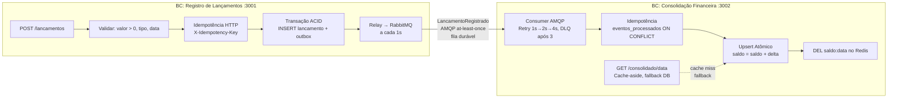

# Domínios e Capacidades de Negócio

## Por que dois bounded contexts

O sistema tem dois bounded contexts porque possuem **invariantes distintas, ciclos de mudança diferentes e requisitos de disponibilidade incompatíveis**:

| Critério | BC: Registro de Lançamentos | BC: Consolidação Financeira |
|---|---|---|
| Invariante central | "Todo lançamento tem valor positivo, tipo e data" | "Saldo = Σ créditos − Σ débitos para um dia" |
| O que nunca pode falhar | Registro do lançamento | — |
| Pode ficar indisponível? | Não — requisito explícito | Sim — consistência eventual é aceitável |
| Modelo de escrita | OLTP, write-heavy, request-driven | Event-driven, append via eventos do broker |
| Modelo de leitura | Listagem por data | Projeção agregada (`saldo_diario`) |
| Schema de banco | `lancamentos`, `outbox` | `saldo_diario`, `eventos_processados` |
| Quem escreve no banco | API (request do cliente) | Consumer (evento do broker) |

Colocar os dois no mesmo processo os tornaria **cúmplices em falha**: um crash no Consumer, um OOM ou um deadlock no Consolidado derrubaria o processo inteiro, levando o endpoint de lançamentos junto. A separação de processo — com comunicação assíncrona — é a única forma de satisfazer o requisito de disponibilidade independente (RNF-01) sem circuit breakers internos que mascaram perdas de dados.

---

## Linguagem Ubíqua

### BC: Registro de Lançamentos

| Termo | Definição neste contexto |
|---|---|
| **Lançamento** | Evento financeiro primitivo: débito ou crédito, com valor, data de competência e descrição opcional |
| **Valor** | Montante positivo em BRL, precisão de 2 casas decimais. Armazenado como `NUMERIC(15,2)`; tratado como `Decimal` (decimal.js) no código — nunca `float` |
| **Tipo** | `credito` (entrada de caixa) ou `debito` (saída de caixa) |
| **Data do Lançamento** | Data de **competência** informada pelo cliente (`YYYY-MM-DD`) — determina em qual dia o saldo é afetado, independente do horário de processamento |
| **Chave de Idempotência** | Token opaco do cliente (`X-Idempotency-Key`) que identifica uma intenção de requisição; o servidor retorna a resposta original se a mesma chave aparecer novamente |
| **Outbox** | Tabela interna (`outbox`) que contém o evento `LancamentoRegistrado` gravado na mesma transação do lançamento; não é exposta na API |
| **Relay** | Processo interno (`setInterval` de 1s) que lê o outbox pendente e publica no broker; parte do serviço Lançamentos |
| **Evento de domínio** | `LancamentoRegistrado` — publicado após cada lançamento aceito, pelo Relay, via outbox |

### BC: Consolidação Financeira

| Termo | Definição neste contexto |
|---|---|
| **Saldo Diário** | Projeção agregada por data: `total_creditos`, `total_debitos`, `saldo = creditos - debitos`; armazenado em `saldo_diario` |
| **Evento Processado** | Registro na tabela `eventos_processados` de um `eventoId` já aplicado ao saldo; garante idempotência do consumer |
| **Cache de Saldo** | Representação em Redis do saldo de uma data; TTL de 60s; **não é fonte de verdade** — pode ser descartado a qualquer momento |
| **Consistência Eventual** | O saldo reflete todos os lançamentos em até 5s após o registro; um GET durante esse intervalo pode retornar saldo desatualizado por no máximo o tempo de propagação do evento |
| **DLQ** | `consolidado.lancamentos.dlq` — destino de mensagens que falharam após 1 tentativa inicial + 3 retries; requer intervenção manual para replay ou descarte |

---

## Diagrama de Contextos e Fluxo de Eventos

---

## Capacidades de Negócio

| Domínio | Capacidade | Implementação | Criticidade |
|---|---|---|---|
| Lançamentos | Registrar lançamento | `POST /lancamentos` + transação ACID (lançamento + outbox) | Alta — nunca pode perder |
| Lançamentos | Listar por data | `GET /lancamentos?data=` | Média |
| Lançamentos | Idempotência do cliente | `X-Idempotency-Key` → `ON CONFLICT` no banco dentro da transação | Alta — evita duplicatas sob retry HTTP |
| Lançamentos | Publicação confiável de eventos | Outbox Pattern — evento gravado na mesma tx do lançamento | Alta — zero perda mesmo sob falha do broker |
| Consolidado | Calcular saldo diário | Consumer + `ON CONFLICT DO UPDATE SET saldo = saldo_diario.saldo + delta` | Alta — invariante financeira |
| Consolidado | Idempotência do consumer | `eventos_processados` + `ON CONFLICT DO NOTHING` — rowCount=0 → skip | Alta — entrega at-least-once exige isso |
| Consolidado | Consultar saldo | `GET /consolidado/{data}` com cache Redis, fallback Postgres | Alta — caminho quente (50 req/s) |
| Consolidado | Alta disponibilidade de leitura | Cache-aside com TTL 60s + fallback silencioso se Redis indisponível | Média — degrada para leitura direta no DB |

---

## Contrato de Integração — Anti-Corruption Layer

O evento `LancamentoRegistrado` é o **único ponto de integração** entre os dois bounded contexts. Esse contrato foi desenhado com as seguintes garantias:

1. **O Consolidado nunca acessa o banco do Lançamentos.** O saldo é sempre calculado a partir dos eventos, não de leitura direta na fonte.
2. **O payload do evento carrega apenas o fato bruto** (valor, tipo, data de competência) — a lógica de acumulação (crédito soma, débito subtrai) é responsabilidade exclusiva do Consolidado.
3. **O Consolidado pode ser reconstruído do zero** somente se o serviço Lançamentos republicar os eventos da tabela `outbox` no broker — o Consolidado não tem acesso ao `outbox` nem ao `lancamentos_db`. A reconstrução é uma operação operacional (não um fluxo de produto) e requer que o serviço Lançamentos exponha um mecanismo de replay. Isso exclui tecnicamente o RabbitMQ puro (sem persistência de histórico) como fonte de verdade para replay; uma evolução futura seria usar um event store dedicado (ex: EventStoreDB) que permita replay sem acoplamento operacional.
4. **Mudanças de schema são versionadas** via `schemaVersion` no payload — permite transição sem deploy coordenado dos dois serviços.

Violações do ACL que **nunca devem ocorrer:**

- JOIN ou query cruzando `lancamentos_db` e `consolidado_db`
- O Consolidado expor endpoints de escrita que o Lançamentos chame diretamente
- O Lançamentos calcular ou expor saldo (é um dado do domínio Consolidado)
- Remover um campo do evento sem bump de `schemaVersion`
